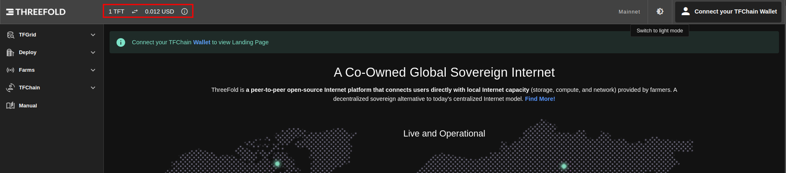

# Billing

## Description

A couple of examples explaining how the billing works on the threefold grid for node and rent contracts.

Some of the used resources should be updated whenever you try to do these calculations, these resources are the TFT price and Cloud Units(SU, CU).

## Current TFT Price

TFT price can be retrieved either from the dashboard, through the price available in the header



or directly through [stellar](https://stellar.expert/explorer/public/asset/TFT-GBOVQKJYHXRR3DX6NOX2RRYFRCUMSADGDESTDNBDS6CDVLGVESRTAC47-1?asset[]=TFT-GBOVQKJYHXRR3DX6NOX2RRYFRCUMSADGDESTDNBDS6CDVLGVESRTAC47-1&filter=markets&market=USDC-GA5ZSEJYB37JRC5AVCIA5MOP4RHTM335X2KGX3IHOJAPP5RE34K4KZVN-1).

## Current Cloud Units value

These can be retrieved directly from the chain. Through the [polakdot UI](https://polkadot.js.org/apps/?rpc=wss%3A%2F%2Ftfchain.grid.tf#/chainstate).
Navigate to `Chain State` then select `tfgridModule` as the query and select `pricingPolicies(u32): Option<PalletTfgridPricingPolicy>`.

Enter the value of the default pricing policy which is `1` or enter the value of any other policy if you need to use a custom one.


> Values on chain are expressed as "units USD per hour" where "1 unit usd" == 10.000.000 (1e7)

## Node Contract

Lets assume that the resources for this deployment are:

```sh
Cru: 2
Mru: 2
Sru: 15
Hru: 0
```

### Calculating the CU

The current CU value is `10 mUSD/h`, please note that prices could be subjected to change.

```sh
CU = min( max(MRU/4, CRU/2), max(MRU/8, CRU), max(MRU/2, CRU/4) )
   = min( max(2/4, 2/2), max(2/8, 2), max(2/2, 2/4) )
   = min( max(0.5, 1), max(0.25, 2), max(1, 0.5) )
   = min( 1, 2, 1 )
   = 1
CU cost/hour = CU * CU pricing
             = 1 * 10 mUSD/h
             = 10 mUSD/h
```

### Calculating the SU

The current SU value is `5 mUSD/h`, please note that prices could be subjected to change.

```sh
SU = HRU/1200 + SRU/200
   = 0/1200 + 15/200
   = 0 + 0.075
   = 0.075
SU cost/hour = SU * SU pricing
             = 0.075 * 5 mUSD/h
             = 0.375 mUSD/h
```

### Calculating the Billing Rate for the contract

The current TFT value is `0.012 USD`, please note that prices could be subjected to change.

```sh
Contract cost/hour = CU cost/hour + SU cost/hour
                   = 10 mUSD/h + 0.375 mUSD/h
                   = 10.375 mUSD/h
                   = 0.010375 USD/h
                   = (0.010375 * 24 * 30)
                   = 7.47 USD/month
                   = 679.09023 TFT/month
                   = 0.943180875 TFT/hour
```

### Applying the discounts

Before assuming that the price listed is the final price, please verify if you qualify for any of the available staking discount levels for additional savings. For more details on these discount levels, refer to the [manual](https://manual.grid.tf/cloud/cloudunits_pricing.html#staking-discount).

For this example lets assume that this twin has 18 months worth of TFTs staked, so the user will be applicable for a Gold discount level (60% discount).

```sh
Cost with 60% discount = 0.943180875 * 0.4
                       = 0.37727235000000003 TFT/hour
```

## Rent Contract

### Getting the resources

For this example we will use node `83` on devnet as an example. You can get the resources of this node using different methods.

- gridproxy

  Using the [nodes endpoint](https://gridproxy.grid.tf/swagger/index.html#/GridProxy/get_nodes__node_id_),then enter the desired node id after it. <https://gridproxy.dev.grid.tf/nodes/83>

- graphql

  Navigate to <https://graphql.dev.grid.tf/graphql>, then use the following query and replace the node id with the desired node id.

  ```sh
  query MyQuery {
  nodes(where: {nodeID_eq: 83}) {
   id
   farmingPolicyId
   resourcesTotal {
     cru
     mru
     sru
     hru
     }
   }
  }

  ```

- TFchain (polkadot UI)

  Through the [polakdot UI](https://polkadot.js.org/apps/?rpc=wss%3A%2F%2Ftfchain.grid.tf#/chainstate).
  Navigate to `Chain State` then select `tfgridModule` as the query and select `nodes(u32): Option<TfchainSupportNode>`.

  

These are the resources for node `83` which will be used for the calculations.

```sh
CRU = 4
SRU = 119.24
HRU = 1863
MRU = 15.55
```

### Calculating CU

The current CU value is `10 mUSD/h`, please note that prices could be subjected to change.

```sh
CU = min( max(MRU/4, CRU/2), max(MRU/8, CRU), max(MRU/2, CRU/4) )
   = min( max(15.55/4, 4/2), max(15.55/8, 4), max(15.55/2, 4/4) )
   = min( max(3.8875, 2), max(1.94375, 4), max(7.775, 1) )
   = min( 3.8875, 4, 7.775 )
   = 3.8875
CU cost/hour = CU * CU pricing
             = 3.8875 * 10 mUSD/h
             = 38.875 mUSD/h
```

### Calculating SU

The current SU value is `5 mUSD/h`, please note that prices could be subjected to change.

```sh
SU = HRU/1200 + SRU/200
   = 1863/1200 + 119.24/200
   = 1.5525 + 0.5962
   = 2.1487
SU cost/hour = SU * SU pricing
             = 2.1487 * 5 mUSD/h
             = 10.7435 mUSD/h
```

### Calculating Billing Rate for the contract

The current TFT value is `0.012 USD`, please note that prices could be subjected to change.

```sh
Contract cost/hour = CU cost/hour + SU cost/hour
                   = 38.875  mUSD/h + 10.7435 mUSD/h
                   = 49.6185 mUSD/h
                   = 0.049618499999999996 USD/h
                   = (0.049618499999999996 * 24 * 30)
                   = 35.725319999999996 USD/month
                   = 3247.7531158799993 TFT/month
```

### Applying the Dedicated Node Discount

There's a default `50%` discount for renting a node, this discount is not related to the staking discount. for more info please check the [manual](https://manual.grid.tf/cloud/cloudunits_pricing.html#dedicated-nodes).

```sh
Cost with 50% discount = 35.725319999999996 * 0.5
                       = 17.862659999999998 TFT/month
```

### Applying the Staking discount

Before assuming that the price listed is the final price, please verify if you qualify for any of the available staking discount levels for additional savings. For more details on these discount levels, refer to the [manual](https://manual.grid.tf/cloud/cloudunits_pricing.html#staking-discount).

For this example lets assume that this twin has 18 months worth of TFTs staked, so the user will be applicable for a Gold discount level (60% discount).

```sh
Cost with 60% discount = 17.862659999999998 * 0.4
                       = 7.145064 TFT/month
```

## Name Contract

To calculate the cost of name contracts you can get its current value from the Pricing Policy.


This value can then be converted to USD.

```sh
uniqueName in USD = 2500 / 10000000
                  = 0.00025 USD/hour

```

And since the current TFT conversion rate is `1 USD = 100 TFT`

```sh
uniqueName in TFT = 0.00025 * 100
                  = 0.025 TFT/hour
```

### Applying Staking discount

Before assuming that the price listed is the final price, please verify if you qualify for any of the available staking discount levels for additional savings. For more details on these discount levels, refer to the [manual](https://manual.grid.tf/cloud/cloudunits_pricing.html#staking-discount).

For this example lets assume that this twin has 18 months worth of TFTs staked, so the user will be applicable for a Gold discount level (60% discount).

```sh
Cost with 60% discount = 0.025 * 0.4
                       = 0.01 TFT/hour

```

## Public IP

To calculate the cost of public ips you can get its current value from the Pricing Policy.


This value can then be converted to USD.

```s
Public IP in USD = 40000 / 10000000
                  = 0.004 USD/hour

```

And since the current TFT conversion rate is `1 USD = 100 TFT`

```sh
Public IP in TFT = 0.004 * 100
                  = 0.4 TFT/hour
```

### Applying Staking discount with public IP

Before assuming that the price listed is the final price, please verify if you qualify for any of the available staking discount levels for additional savings. For more details on these discount levels, refer to the [manual](https://manual.grid.tf/cloud/cloudunits_pricing.html#staking-discount).

For this example lets assume that this twin has 18 months worth of TFTs staked, so the user will be applicable for a Gold discount level (60% discount).

```SH
Cost with 60% discount = 0.4 * 0.4
                       = 0.160 TFT/hour

```

> Note: this value gets added to the billing rate of your deployment.

## Network Usage

Network Usage is calculated for deployments with public ips, it's reprted every hour and its cost can be calculated approximatly as the value of data(sent + recieved) \* the NU value.

So firstly lets calculate the data usage. This can be tracked with network tool like `nload` where it can show the total of the sent and recived.


After than we can get the NU value. you can get its current value from the Pricing Policy.


This value can then be converted to USD.

```sh
NU price in USD = 15000 / 10000000
                  = 0.0015 USD/hour

```

And since the current TFT conversion rate is `1 USD = 100 TFT`

```sh
NU price in TFT = 0.0015 * 100
                  = 0.15 TFT/hour
```

### Applying Staking discount with NU

Before assuming that the price listed is the final price, please verify if you qualify for any of the available staking discount levels for additional savings. For more details on these discount levels, refer to the [manual](https://manual.grid.tf/cloud/cloudunits_pricing.html#staking-discount).

For this example lets assume that this twin has 18 months worth of TFTs staked, so the user will be applicable for a Gold discount level (60% discount).

```sh
Cost with 60% discount = 0.15 * 0.4
                       = 0.06 TFT/hour

```

As an example lets assume that we used a total of 10GB in the last hour, so the next hour the billing rate should be updated to:

```sh
Total network usage = 10GB * 0.06 TFT/hour
                    = 0.6 TFT/hour

Billing rate in the next hour should be: actual cost of the deployment + Total Netowrk Usage.

```

> Note: The calculated value will always be an approximation since it's not possible to manually calculate the exact value of data used.

And since the billing rate gets updated hourly, you can check the billing history from [graphql](https://graphql.dev.grid.tf/graphql) using the following query:

```sh
query MyQuery {
  contractBillReports(where: {contractID_eq: ""}) {
    contractID
    amountBilled
    discountReceived
    timestamp
  }
}

```
