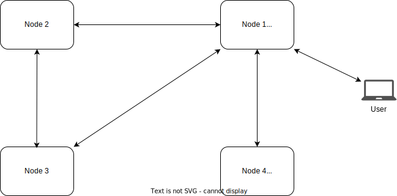

# Wireguard Network

## Overview

The target is to make a private Mesh connection between the nodes so they can reach each other, and also the virtual machines on the top of these nodes using Wireguard. In this document we will try to configure the nodes

## Configuration

This configuration is set on each node using [network workload](../src/zos/znet.ts)

- `ip_range`: an ip range to be used for this network, it needs to be private ip range, normally a /16 subnet is used (e.g. `10.20.0.0/16`)
- `subnet`:  a subnet to be used for this network, it should be a subnet of the entire network ip range, normally a /24 subnet is used for the node (e.g. `10.20.1.0/24`)
- `wireguard_private_key`: an x25519 secret key generated for this node (e.g. `h1UkGZvWGUkBPcs+EyzGTpzr50+vOz1z50nN8szQ260=`)
- `wireguard_listen_port`: a random free port on this node, the used ports can be gotten by sending a request over RMB to the node with command `zos.network.list_wg_ports` (e.g. `7788`)
- `peers`: A list of peers (other nodes or a user access) that they will be on the same network.

Each Peer should have this configuration:

- `subnet`: the subnet set for the other node (e.g. 10.20.2.0/24)
- `wireguard_public_key`: the public key related to the secret key generated of the node (e.g. `BA2U9NoQD92r1LkSf46WMJgl/eJ3+2dK9FyrX2/+y0E=`)
- `allowed_ips`: this should be the node's subnet and the wireguard routing ip that should start with `100.64` then the 2nd and 3rd part of the node's subnet `["10.20.2.0/24", "100.64.20.2/32"]`
- `endpoint`: an endpoint for the node, this should be public, if the node is an access node, it can be gotten by sending a request over RMB to the node with command `zos.network.public_config_get` , but if it's not an access node, the command should be `zos.network.interfaces` and get `zos` interface  (e.g. `[2a10:b600:0:9:ec4:7aff:fe30:2d50]:5848`)

## Exceptions

### User Access or Hidden Nodes

In case the user needs an access to this network or adding a node that doesn't have any public interface (hidden node), this will require the following:

- adding an access node to this network (a node with a public config ipv4 or ipv6, but it can't be guaranteed that the user or the hidden node can reach ipv6, so this access node should have ipv4 interface)
- some changes for the pervious configuration in the Peer's part:
- `endpoint`: will be empty string
- `allowed_ips`:
  - access nodes: it will be normally added,
  - other nodes: they will not have this peer as the other nodes doesn't know how to reach this peer, so the idea is to make the route of this peer to go through the access node's peer. for example if the access node's subnet is `10.20.3.0/24` and the user access or the hidden node's subnet is `10.20.4.0/24`, the allowed_ips will be `["10.20.3.0/24","100.64.20.3/32","10.20.4.0/24","100.64.20.4/32"]`.
  - hidden nodes: the allowed ips will be all in the access node's peer.

## Full Example

In the example, we will try to make a network with 2 normal nodes, one access node, one hidden node, and give an access to the user to the network.



### Given

- `ip_range`: `10.20.0.0/16`

#### Node 1 (Access Node)

- `subnet`: `10.20.2.0/24`
- `sk`: `i6jW4WaD821bzKyicVvLMBwyZIa4dnbplU0JR9eLU3o=`
- `pk`: `CLp2A2bJXRAKLViwnscbUDL3dW9xC/mGbh2RBzP4sjU=`
- `public interface`: `185.206.122.31`
- `free wireguard port`: `5566`

#### Node 2

- `subnet`: `10.20.3.0/24`
- `sk`: `A0cQJDMc/1pkMr/GsHzmWhPq8JzteTfIsK5EQ1w+w/w=`
- `pk`: `GNBnheqz9IMG23VAiJiMM+dLsr8QHEhOhMYc4KQUTEw=`
- `public interface`: `2a10:b600:0:9:ec4:7aff:fe30:2d50`
- `free wireguard port`: `1234`

#### Node 3

- `subnet`: `10.20.4.0/24`
- `sk`: `4VMG2ARyhvLg6Q354R4gsumM55dBQsmgQcLzECKMs+E=`
- `pk`: `nAxYzSKsL0xUbp3dBbhu4/BoGKEyiiLnqNZnDrzfaDo=`
- `public interface`: `2a10:b600:0:9:225:90ff:fe82:7130`
- `free wireguard port`: `7777`

#### Node 4 (Hidden Node)

- `subnet`: `10.20.5.0/24`
- `sk`: `6UP/6EYRZBVyDYAFU2ptlQ1CBmi8v7cYK1fM31wqD7Y=`
- `pk`: `Bda/4eufH4d5axfxKpybZeY5kc+oh6mdJRSjoktPGxU=`
- `free wireguard port`: `3443`

#### User access

- `subnet`: `10.20.6.0/24`
- `sk`: `cDp2M0ffIINlxBRY35MZJKrLkcglg9FnowKpb3wKlRc=`
- `pk`: `As/BM2GGdxw1gYk6EnUoTAJa9xio4AA2NP1b6Dny6XQ=`

### Result

#### Node 1 (Access Node)

```ts
{
    subnet: "10.20.2.0/24",
    ip_range: "10.20.0.0/16",
    wireguard_private_key: "i6jW4WaD821bzKyicVvLMBwyZIa4dnbplU0JR9eLU3o=",
    wireguard_listen_port: 5566,
    peers: [{
            subnet: "10.20.3.0/24",
            wireguard_public_key: "GNBnheqz9IMG23VAiJiMM+dLsr8QHEhOhMYc4KQUTEw=",
            allowed_ips: [
                "10.20.3.0/24",
                "100.64.20.3/32"
                ],
            endpoint: "[2a10:b600:0:9:ec4:7aff:fe30:2d50]:1234"
            },
            {
            subnet: "10.20.4.0/24",
            wireguard_public_key: "nAxYzSKsL0xUbp3dBbhu4/BoGKEyiiLnqNZnDrzfaDo=",
            allowed_ips: [
                "10.20.4.0/24",
                "100.64.20.4/32"
                ],
            endpoint: "[2a10:b600:0:9:225:90ff:fe82:7130]:7777"
            },
            {
            subnet: "10.20.5.0/24",
            wireguard_public_key: "Bda/4eufH4d5axfxKpybZeY5kc+oh6mdJRSjoktPGxU=",
            allowed_ips: [
                "10.20.5.0/24",
                "100.64.20.5/32"
                ],
            endpoint: ""
            },
            {
            subnet: "10.20.6.0/24",
            wireguard_public_key: "As/BM2GGdxw1gYk6EnUoTAJa9xio4AA2NP1b6Dny6XQ=",
            allowed_ips: [
                "10.20.6.0/24",
                "100.64.20.6/32"
                ],
            endpoint: ""
            }]
}
```

#### Node 2 

```ts
{
    subnet: "10.20.3.0/24",
    ip_range: "10.20.0.0/16",
    wireguard_private_key: "A0cQJDMc/1pkMr/GsHzmWhPq8JzteTfIsK5EQ1w+w/w=",
    wireguard_listen_port: 1234,
    peers: [{
            subnet: "10.20.2.0/24",
            wireguard_public_key: "CLp2A2bJXRAKLViwnscbUDL3dW9xC/mGbh2RBzP4sjU=",
            allowed_ips: [
                "10.20.2.0/24",
                "100.64.20.2/32",
                "10.20.5.0/24",
                "100.64.20.5/32",
                "10.20.6.0/24",
                "100.64.20.6/32"
                ],
            endpoint: "185.206.122.31:5566"
            },
            {
            subnet: "10.20.4.0/24",
            wireguard_public_key: "nAxYzSKsL0xUbp3dBbhu4/BoGKEyiiLnqNZnDrzfaDo=",
            allowed_ips: [
                "10.20.4.0/24",
                "100.64.20.4/32"
                ],
            endpoint: "[2a10:b600:0:9:225:90ff:fe82:7130]:7777"
            }]
}
```

#### Node 3

```ts
{
    subnet: "10.20.4.0/24",
    ip_range: "10.20.0.0/16",
    wireguard_private_key: "4VMG2ARyhvLg6Q354R4gsumM55dBQsmgQcLzECKMs+E=",
    wireguard_listen_port: 7777,
    peers: [{
            subnet: "10.20.2.0/24",
            wireguard_public_key: "CLp2A2bJXRAKLViwnscbUDL3dW9xC/mGbh2RBzP4sjU=",
            allowed_ips: [
                "10.20.2.0/24",
                "100.64.20.2/32",
                "10.20.5.0/24",
                "100.64.20.5/32",
                "10.20.6.0/24",
                "100.64.20.6/32"
                ],
            endpoint: "185.206.122.31:5566"
            },
            {
            subnet: "10.20.3.0/24",
            wireguard_public_key: "GNBnheqz9IMG23VAiJiMM+dLsr8QHEhOhMYc4KQUTEw=",
            allowed_ips: [
                "10.20.3.0/24",
                "100.64.20.3/32"
                ],
            endpoint: "[2a10:b600:0:9:ec4:7aff:fe30:2d50]:1234"
            }]
}
```

#### Node 4 (Hidden Node)

```ts
{
    subnet: "10.20.5.0/24",
    ip_range: "10.20.0.0/16",
    wireguard_private_key: "6UP/6EYRZBVyDYAFU2ptlQ1CBmi8v7cYK1fM31wqD7Y=",
    wireguard_listen_port: 3443,
    peers: [{
            subnet: "10.20.2.0/24",
            wireguard_public_key: "CLp2A2bJXRAKLViwnscbUDL3dW9xC/mGbh2RBzP4sjU=",
            allowed_ips: [
                "10.20.2.0/24",
                "100.64.20.2/32",
                "10.20.3.0/24",
                "100.64.20.3/32",
                "10.20.4.0/24",
                "100.64.20.4/32",
                "10.20.6.0/24",
                "100.64.20.6/32"
                ],
            endpoint: "185.206.122.31:5566"
            }]
}
```

#### User access

```toml
[Interface]
Address = 10.20.6.0/24
PrivateKey = cDp2M0ffIINlxBRY35MZJKrLkcglg9FnowKpb3wKlRc=

[Peer]
PublicKey = CLp2A2bJXRAKLViwnscbUDL3dW9xC/mGbh2RBzP4sjU=
AllowedIPs = 10.20.0.0/16, 100.64.20.0/32
PersistentKeepalive = 25
Endpoint = 185.206.122.31:5566
```
