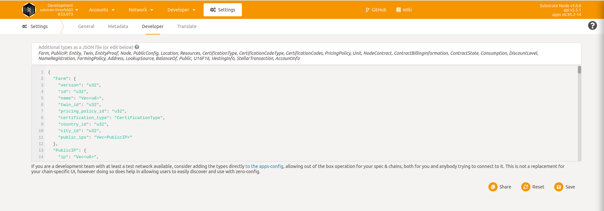
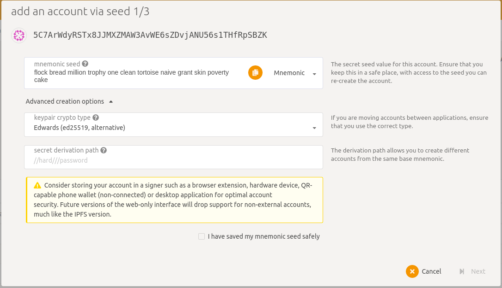
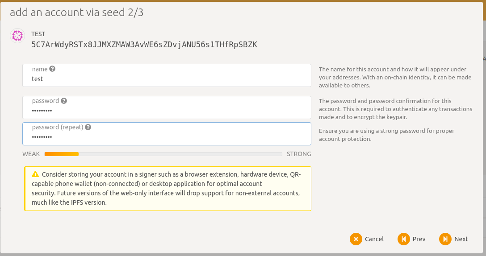
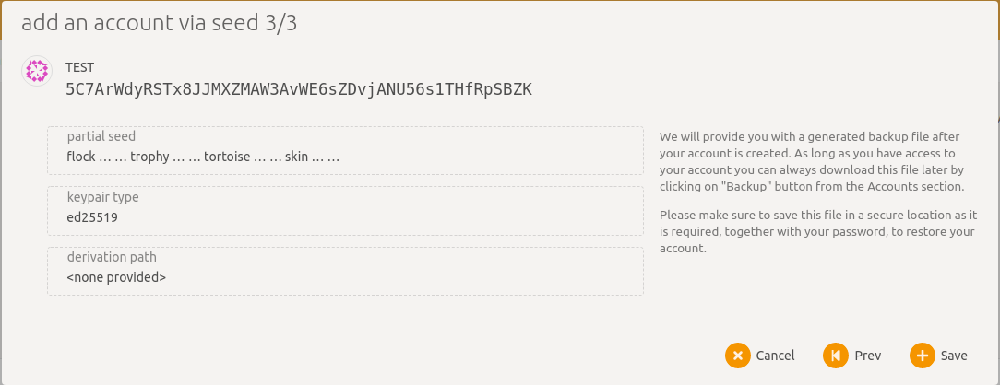
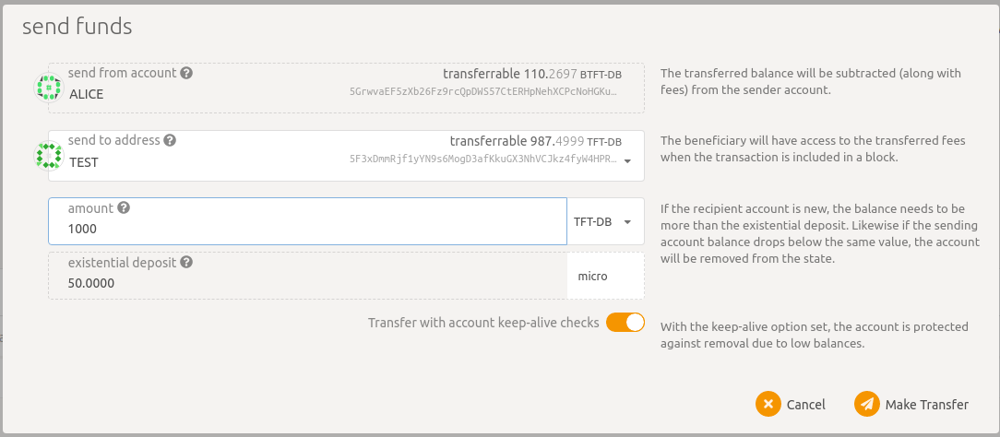
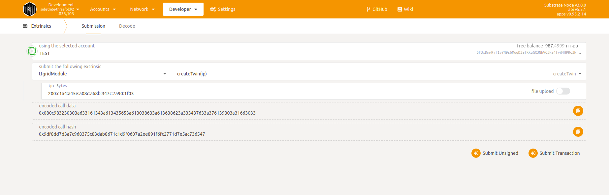
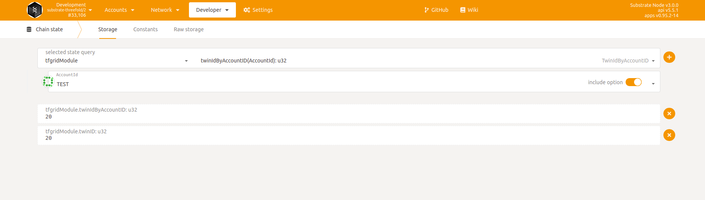

# Test setup

Steps to deploy a test scenario using zos3, yggdrasil,polkadot.

## Create twin

### 1. Create account on substrate using polkadot

- Add the required [types in json format](https://github.com/threefoldtech/tfgrid-api-client/blob/master/types.json) to the [developer settings](https://polkadot.js.org/apps/?rpc=wss%3A%2F%2Fexplorer.devnet.grid.tf%2Fws#/settings/developer) in polkadot. *note: don't forget to save*

- Click on `Add an account` in [polkadot accounts](https://polkadot.js.org/apps/?rpc=wss%3A%2F%2Fexplorer.devnet.grid.tf%2Fws#/accounts)
- Save the mnemonic seed in a safe place

- Click on `Advanced creation options` and select the keyword crypto type of **`Edwards (ed25519, alternative)`**
`

- Add a name and password for your account (remember the password for future usage)

- Fund the account with test funds (Click on send funds from the account of Alice to your account name)

### 2. Setup yggdrasil (optional to obtain public Ipv6 address)

- download and install yggdrasil using the following [link](https://github.com/yggdrasil-network/yggdrasil-go/releases/tag/v0.4.0)
- Start it initially to init the configurations:

        systemctl start yggdrasil
    Or using

        yggdrasil -useconffile /etc/yggdrasil.conf
- Add the needed [peers](https://publicpeers.neilalexander.dev/) in the config file generated under Peers.

  **example**:

        Peers:
        [
        tls://54.37.137.221:11129
        ]

- Restart yggdrasil by

        systemctl restart yggdrasil

### 3. Create twin on substrate using polkadot

- Select the options to create the twin in [polkadot developer extrinsics](https://polkadot.js.org/apps/?rpc=wss%3A%2F%2Fexplorer.devnet.grid.tf%2Fws#/extrinsics)

  - Selected account -> your Account name

  - Extrinsic module to be submitted(from drop down menu) -> tfgridModule

  - Extrinsic method to be submitted -> createTwin(ip)

  - ip -> Ipv6 obtained from your yggdrasil
- Submit transaction and enter password selected when creating the account

- To get your twin ID, select the options required in [polkadot developer chainstate](https://polkadot.js.org/apps/?rpc=wss%3A%2F%2Fexplorer.devnet.grid.tf%2Fws#/chainstate) and click on the +
  - Module -> tfgridModule
  - Method -> twinID(): u32

